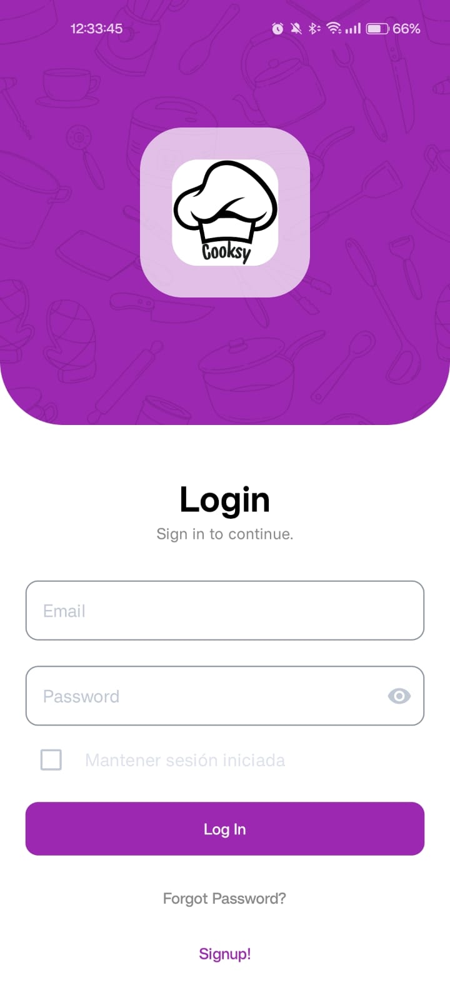
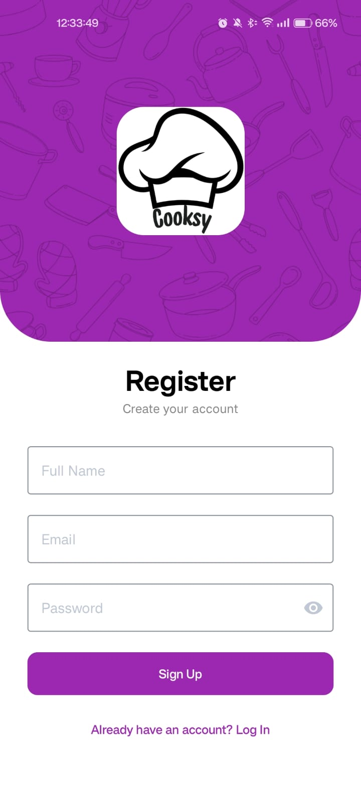
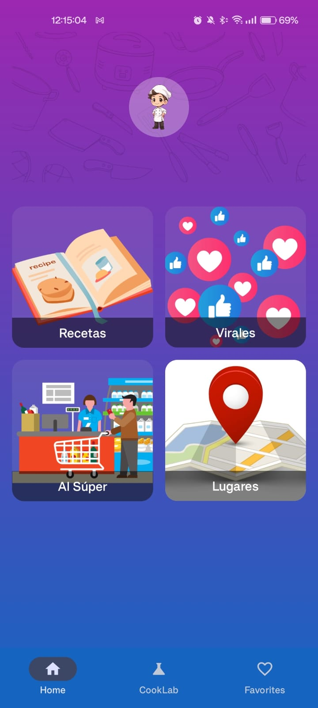
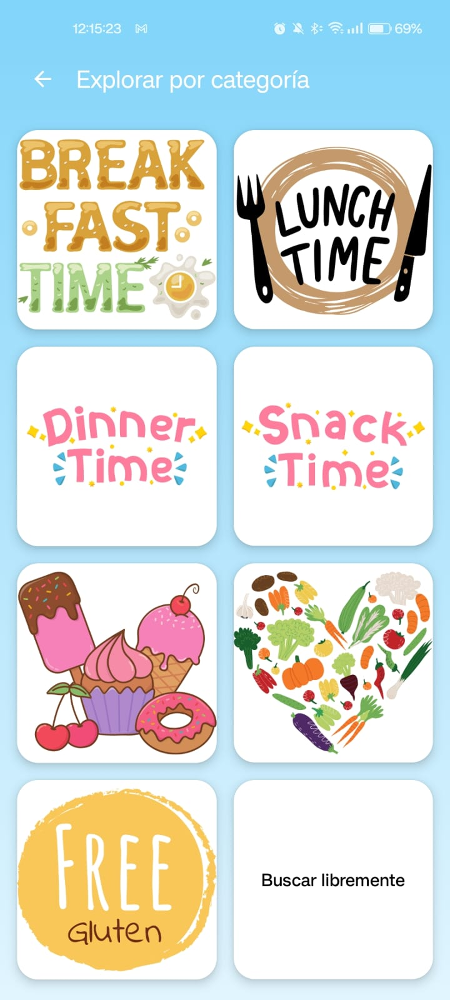
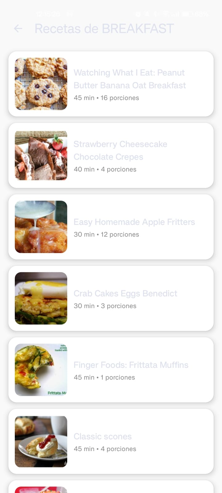
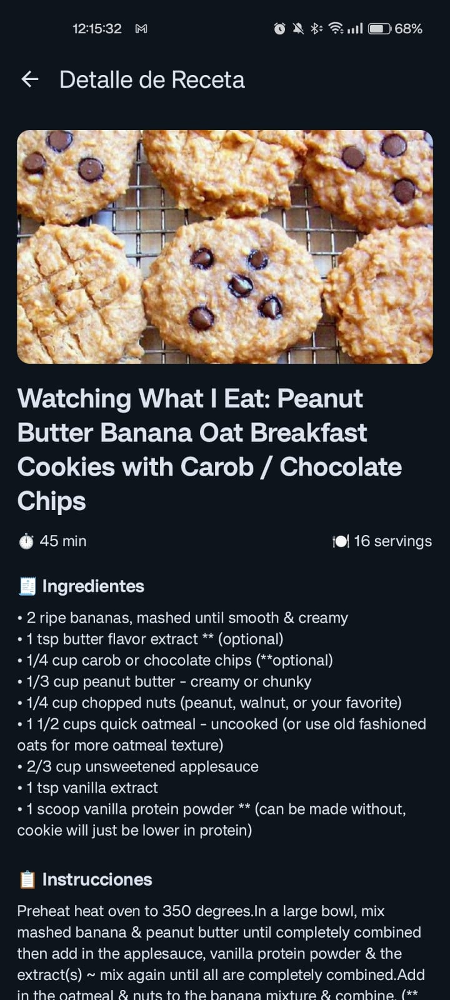
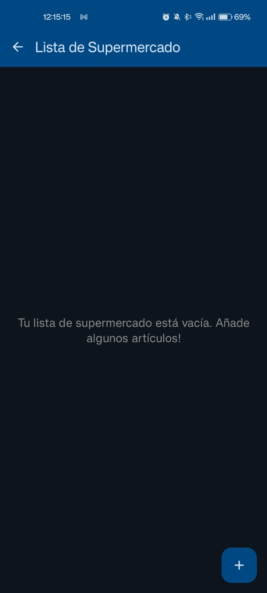
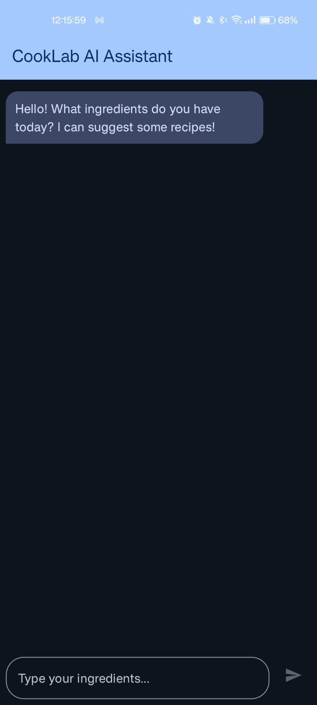
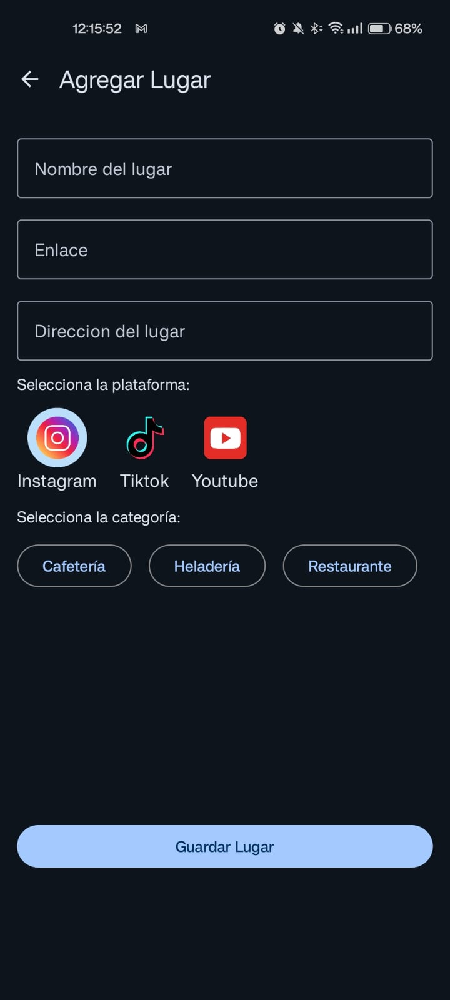
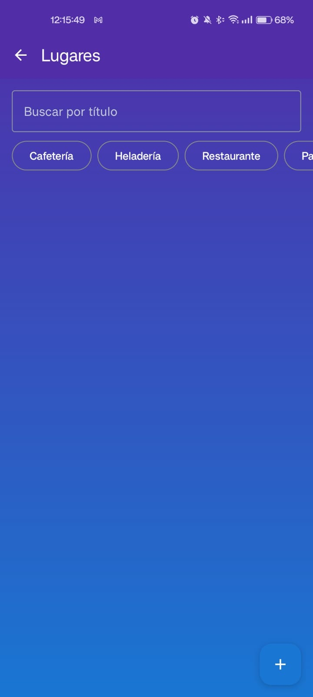

# Cooksy App 🍳📱

## 🖊️ Description

Cooksy is an Android app designed to help you discover new recipes, plan your meals, chat with an AI to generate meal ideas based on what you have, save inspiring food posts or interesting places, and manage your shopping list easily and intuitively.

With Cooksy you can:

- Explore a wide variety of recipes  
- Save your favorites  
- Organize your ingredients  
- Chat with a culinary AI  
- Keep track of your grocery list  

---

## ✨ Main Features

- **Recipe Exploration:** Browse through a diverse collection of recipes.  
- **Recipe Details:** View ingredients, steps, estimated time, and more.  
- **Favorites:** Save recipes for quick access.  
- **Cooklab (AI):** Chat with an AI to generate recipes based on your available ingredients.  
- **Shopping List:**  
  - Add, edit, and delete items  
  - Mark items as purchased  
  - (Coming soon) Cloud sync  
- **Saved Posts:** Store viral recipes or places you’d like to visit  
- **User Authentication:** Secure registration and login  
- **User Profile:** Edit name, avatar, and preferences  

---

## 🛠️ Technologies Used

- **Language:** Kotlin  
- **UI:** Jetpack Compose  
- **Architecture:** MVVM  
- **Asynchronous:** Kotlin Coroutines + Flow  
- **Navigation:** Navigation Compose  
- **Database:** Firebase Firestore  
- **Authentication:** Firebase Auth  
- **Local Storage:** SharedPreferences (and Room)  
- **Image Loading:** Coil  
- **Networking:** Retrofit  

---

## 📅 General Architecture (MVVM)

UI (Screens Composables) <--> ViewModel <--> (Use Case) <--> Repository <--> Data Sources
(Firebase, API, Local)

### I. PRESENTATION LAYER (UI) - Module `:app`

#### A. UI (Jetpack Compose)

- `MainActivity.kt`
- Screens (`presentation.screens.*`):  
  - **auth/**  
    - LoginScreen.kt  
    - RegisterScreen.kt  
    - StartUpScreen.kt  
  - **home/**  
    - HomeScreen.kt (Featured recipes, access to "Places")  
  - **recipes/**  
    - RecipesListScreen.kt  
    - RecipeDetailScreen.kt  
    - RecipeSearchScreen.kt  
    - CategorySelectionScreen.kt  
    - **ViralRecipesScreen.kt**  
  - **supermarket/**  
    - SupermarketListScreen.kt  
    - AddEditSupermarketItemScreen.kt  
  - **places/**  
    - NearbySupermarketsScreen.kt  
    - PlaceDetailScreen.kt  
  - **profile/**  
    - ProfileScreen.kt  
    - EditProfileScreen.kt  
  - **components/**  
    - CardSectionSmall.kt  
    - Other reusable components  
- Navigation (`presentation.navigation.*`):  
  - AppNavGraph.kt  
  - Routes.kt (includes routes for new screens)  

#### B. ViewModels (`viewModel.*`)

- SessionViewModel.kt  
- RecipeViewModel.kt (can include viral recipes logic)  
- ViralRecipeViewModel.kt (optional if logic differs)  
- SupermarketViewModel.kt  
- PlacesViewModel.kt (new: for location and places logic)  

---

### II. DOMAIN LAYER (Optional but recommended)

Use Cases:  
- auth/  
- recipes/  
  - GetRecipesUseCase.kt  
  - GetViralRecipesUseCase.kt  
- supermarket/  
- places/  
  - FindNearbySupermarketsUseCase.kt  
  - GetPlaceDetailsUseCase.kt  

---

### III. DATA LAYER

#### A. Repositories (`data.repository.*`)

- AuthRepository.kt  
- RecipeRepository.kt (handles both regular and viral recipes)  
- ViralRecipeRepository.kt (optional)  
- PlacesRepository.kt (interacts with location and places APIs)  

#### B. Data Sources

1. **Remote:**  
   - Firebase: Auth, Firestore  
   - Google Maps Platform:  
     - Places API  
     - Maps SDK (for map UI)  
   - External Recipe APIs (if applicable)  

2. **Local:**  
   - SharedPreferences  
   - Room (if applicable)  
   - Device Location Services  

#### C. Models (`data.model.*`)

- User.kt  
- SupermarketItem.kt  
- **recipes/**  
  - RecipeResponse.kt  
  - RecipeUiState.kt  
  - SectionItem.kt  
  - ViralRecipe.kt  
- **places/**  
  - Place.kt  
  - NearbySearchResponse.kt  

---

📷 Screenshots

 <table> <tr> <td></td> <td></td> <td></td> </tr> <tr> <td></td> <td></td> <td></td> </tr> <tr> <td></td> <td></td> <td></td> </tr> <tr> <td colspan="3" align="center"></td> </tr> </table> 

## 📷 Screenshots

### 🔐 Login Screen  

### 📝 Register Screen  

### 🏠 Home Screen  

### 🍽️ Recipes  

### 📋 List of Recipes  

### 📖 Recipe Details  

### 🛒 Supermarket List  

### 🤖 Cooklab (AI Chat)  

### 📍 Places  

### 🗺️ Place Detail  

---

## ⚙️ Project Setup

1. Clone the repository  
2. Open in Android Studio  
3. Configure Firebase (`google-services.json`)  
4. Set up Google Maps API Key (if using Places)  
5. Run the project on your emulator/device  

---

## 📖 Quick Start Guide

1. Sign up or log in  
2. Browse or search for recipes  
3. Save your favorites  
4. Add items to the shopping list  
5. Save viral recipe or location posts  
6. Chat with the AI based on your ingredients  
7. Discover nearby supermarkets from the "Places" section  
8. Customize your profile  

---

## 🎉 Contributing

Contributions are welcome!

1. Fork the project  
2. Create a new branch: `git checkout -b feature/YourFeature`  
3. Commit your changes: `git commit -m "Add YourFeature"`  
4. Push to the branch: `git push origin feature/YourFeature`  
5. Open a Pull Request  

---

## ❤️ Author

Developed with passion by **Sacroisky Francisco**
